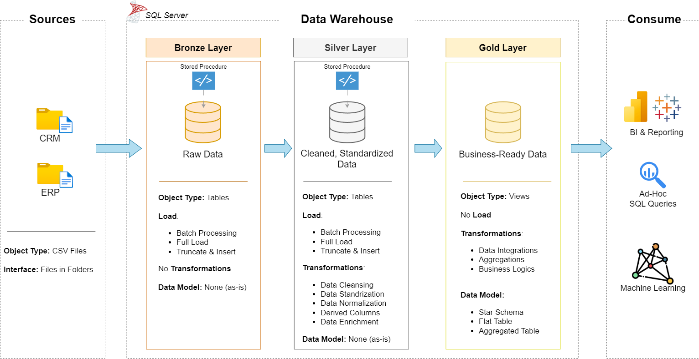
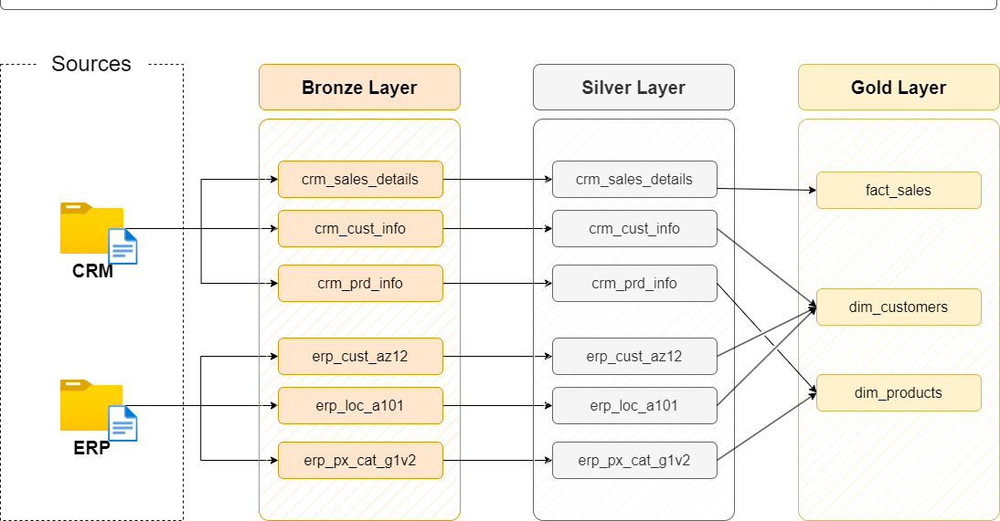
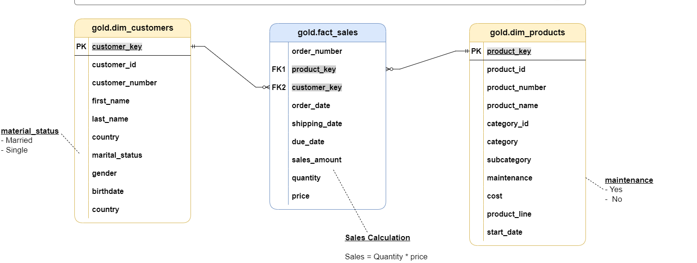

# 🗃️ SQL Data Warehouse Project – Retail Sales Analytics

This project demonstrates the design and implementation of a **modern layered SQL Data Warehouse** using T-SQL and SSMS.  
It simulates real-world retail sales data flowing through **Bronze → Silver → Gold** layers with transformation logic, procedures, and business-ready insights.

---

## 🏗️ Architecture Overview

### 📌 Medallion Architecture

- **Bronze Layer** – Raw data ingestion from CSV (as-is)
- **Silver Layer** – Cleaned, normalized, and deduplicated
- **Gold Layer** – Star-schema modeled for analytics

---

## 🔁 Data Flow Pipeline

The above flow shows:
- How CRM and ERP data sources are ingested
- How data is transformed via stored procedures
- How final tables are prepared for BI consumption

---

## 🧼 Data Model

---

## 📂 Repository Structure

SQL-Data-Warehouse/
│
├── datasets/ # Raw CSV files from CRM & ERP
├── bronze/ # Raw table scripts
├── silver/ # Cleaned and transformed table scripts
├── gold/ # Aggregated business logic (star schema)
├── procedures/ # Stored procedures for each layer
├── docs/ # Diagrams and supporting documentation
│ ├── data_architecture.png
│ ├── data_flow.png
│ └── silver_transformation.png
└── README.md # You're here!

---

## 🛠️ Tools Used

- SQL Server (SSMS)
- T-SQL (Stored Procedures, Views)
- Git & GitHub
- Draw.io for visual documentation

---

## 📈 Features

- 🚀 End-to-end automated ETL pipeline via procedures
- 🧹 Deduplication using `ROW_NUMBER()`
- 🧠 Data classification with `CASE`, `ISNULL`, `TRIM`
- 🧾 Time-based transformations with `LEAD()` and `DATEDIFF()`
- 🛡️ Error handling using `TRY...CATCH`

---

## 📊 Key Use Cases

- Customer segmentation & demographics
- Product performance analysis
- Sales trends & forecasting-ready models

##👨‍💻 Author

-Rohith A P
-📧 rohithap0819@gmail.com
-🔗 LinkedIn
-🔗 GitHub
